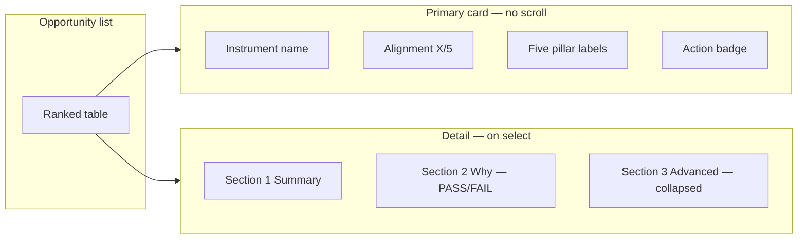

# Thesis Opportunity Engine — Implementation Plan (pre-code)

**Status:** Approved for implementation after wireframe review.  
**Principle:** HTPL interprets; the user decides in under 10 seconds.  
**Not in scope for this phase:** New routes, new data feeds, COT pipeline changes.

---

## 1. Problem statement

| Today | Target |
|-------|--------|
| Narrative-first (`headline`, `story`, “Long exposure +17k”) | Conclusion-first (`Alignment 4/5`, `PAY ATTENTION`) |
| Equal-weight UI (tiers, trends, evolution, snapshots) | Visual hierarchy: Summary → Alignment → Action → Evidence → Advanced |
| Sort by tier + conviction | Sort by **opportunity rank** (alignment + action tier) |
| Assumes COT literacy | Plain institutional labels only |

---

## 2. Target experience (10-second rule)



**Wireframe (interactive):** open `docs/wireframes/thesis-opportunity-engine.html` in a browser.

**Visual mockups (static):**

- List + summary: `assets/thesis-opportunity-engine-mockup.png`
- Detail breakdown: `assets/thesis-opportunity-detail-mockup.png`

---

## 3. Alignment Score framework

### 3.1 Five pillars

| Pillar | User-facing label | Primary inputs (existing HTPL) | PASS when (long thesis) |
|--------|-------------------|--------------------------------|-------------------------|
| **Valuation** | `UNDERVALUED` / `FAIR VALUE` / `OVERVALUED` | `valuation_state`, `valuation_score` (V1 from valuation plan) or **proxy** until wired | Undervalued |
| **Institutions** | `STRONGLY BULLISH` … `STRONGLY BEARISH` | `cot_bias`, `cot_score`, `positioning_state` | Bullish (score ≥ 6 → “strongly”) |
| **Retail** | `BULLISH` / `BEARISH` / `NEUTRAL` | Legacy NR net / 4w Δ (`cot_positioning_groups.nonreportable`) | Bearish (contrarian to long) |
| **Seasonality** | `BULLISH` / `NEUTRAL` / `BEARISH` | `seasonality_state` (future) or **calendar proxy** | Bullish |
| **Location** | `AT DEMAND` / `AWAITING DEMAND ZONE` / `AT SUPPLY` / … | `zone_focus`, `tactical_posture` from confluence / institutional L5 | Demand-aligned for long |

Short thesis: mirror rules (Overvalued, Bearish institutions, Bullish retail, Bearish seasonality, Supply).

### 3.2 Alignment count

```
alignment_pass_count = count(pillar.pass === true)
alignment_total = 5
alignment_label = "{pass} / {total}"
```

Each pillar exports:

```json
{
  "pillar": "valuation",
  "label": "Valuation",
  "state": "UNDERVALUED",
  "score_display": "8.4 / 10",
  "pass": true,
  "wired": true,
  "one_line": "Price sits in the lower third vs macro fair-value anchor."
}
```

Unwired pillar: `wired: false`, `pass: null`, `state: "UNAVAILABLE"`, does **not** count toward alignment (denominator shrinks) **OR** counts as FAIL — **recommendation: count as FAIL** so users see 2/5 not false 5/5. Document in UI: “Seasonality not wired”.

### 3.3 Action mapping (derived, not user-editable)

| Alignment | Conviction trend | Action | Sort priority |
|-----------|------------------|--------|---------------|
| 5/5 | not deteriorating | **HIGH ATTENTION** | 1 |
| 4/5 | any | **PAY ATTENTION** | 2 |
| 3/5 | improving | **PAY ATTENTION** | 3 |
| 3/5 | else | **WATCH** | 4 |
| ≤ 2/5 | any | **NO EDGE** | 5 |
| Invalidated / archived | — | **CLOSED** | 9 |

Action is a **single enum** on the opportunity object — never a paragraph.

### 3.4 Opportunity rank (table sort key)

```text
rank_score =
  alignment_pass_count * 20
  + action_priority_weight   // HIGH=50, PAY=35, WATCH=15, NO_EDGE=0
  + min(cot_score, 10) * 2   // tie-breaker only
```

Sort: `rank_score` DESC, then `alignment_pass_count` DESC, then market name.

---

## 4. Data architecture

### 4.1 New Python module

```
src/hptl/thesis_tracker/
  alignment.py          # pillar evaluators + PASS/FAIL
  opportunity.py        # action + rank_score + opportunity_summary
  run_opportunity_refresh.py  # attach to thesis export / seed
```

Replace narrative-first `build_decision()` as the **primary** export field:

```json
{
  "opportunity": {
    "alignment": { "pass": 4, "total": 5, "label": "4 / 5", "pillars": [...] },
    "action": "PAY ATTENTION",
    "action_key": "pay_attention",
    "rank_score": 87,
    "summary": {
      "instrument_display": "CANADIAN DOLLAR",
      "valuation": { "score_display": "8.4 / 10", "state": "UNDERVALUED" },
      "institutions": { "state": "STRONGLY BULLISH" },
      "retail": { "state": "BEARISH" },
      "seasonality": { "state": "BULLISH" },
      "location": { "state": "AWAITING DEMAND ZONE" }
    },
    "why": [
      { "pillar": "valuation", "pass": true, "detail": "..." },
      ...
    ]
  },
  "decision": { ... }   // retained for advanced / backward compat, demoted
}
```

`store.save_and_export()` runs `build_opportunity(thesis)` on every thesis after load/seed.

### 4.2 Snapshot fields to copy from confluence (extend `snapshot_from_record`)

| Field | Source |
|-------|--------|
| `zone_focus` | record `zone_focus` or `institutional_context.tactical.zone_focus` |
| `tactical_posture` | institutional L5 |
| `retail_net` / `retail_bias` | `cot_positioning_groups.nonreportable` |
| `valuation_state` / `valuation_score` | when valuation V1 ships; until then proxy from macro map percentile |

### 4.3 JS mirror

```
web-dashboard/src/thesisTracker/
  opportunityModel.js   # ACTION_META, sortOpportunities()
  alignmentEngine.js    # client-side rebuild for local-only theses
  opportunitySummary.jsx  # ThesisSummaryCard component
```

Server export includes `opportunity`; local theses compute via `alignmentEngine.js`.

---

## 5. UI components (new / reworked)

### 5.1 `ThesisSummaryCard` (primary card)

- Full-width on mobile; top of detail column on desktop.
- **No scroll** inside card: fixed 5-row pillar grid + alignment + action.
- Typography scale:
  - Instrument: `2rem` bold uppercase
  - Alignment: `3rem` numeric
  - Action: full-width badge
  - Pillars: label `0.7rem`, value `1rem`

### 5.2 `OpportunityTable` (replaces watchlist columns)

| Column | Content |
|--------|---------|
| Instrument | Display name (short code optional) |
| Alignment | `4 / 5` tabular |
| Action | `HIGH ATTENTION` / `PAY ATTENTION` / `NO EDGE` |

Remove: “What’s happening”, sparkline in **primary** row (move sparkline to Advanced only).

### 5.3 `OpportunityDetail` (three sections)

1. **Thesis Summary** — reuse `ThesisSummaryCard`
2. **Why this score exists** — pillar PASS/FAIL list + one-line `why[].detail` each
3. **Advanced detail** — `<details>` wrapping current: evolution, snapshots, COT table, notes, readiness

### 5.4 Page layout change

```text
┌─────────────────────────────────────────────────────────────┐
│  Thesis Opportunity Engine    [filter: Action ▼] [Reload]   │
├──────────────────────────────┬──────────────────────────────┤
│  OpportunityTable (ranked)   │  ThesisSummaryCard (sticky)  │
│                              │  Section 2 Why               │
│                              │  Section 3 Advanced (fold)   │
└──────────────────────────────┴──────────────────────────────┘
```

On viewports &lt; 960px: selecting a row navigates summary to top (sticky), table below.

### 5.5 Deprecate (hide from default)

- `dec.headline`, `dec.story`, `EvolutionPanel` in default view
- Tier filter bar → replace with **Action filter** (High / Pay / Watch / No edge)
- “Narrative confidence” badge

---

## 6. Implementation phases

| Phase | Work | Exit criteria |
|-------|------|---------------|
| **T0** | Wireframe + plan sign-off | This doc + HTML + PNGs reviewed |
| **T1** | `alignment.py` + `opportunity.py` + export on seed | JSON has `opportunity` for all seeded theses |
| **T2** | `ThesisSummaryCard` + `OpportunityTable` + sort | Table shows `COPPER \| 5/5 \| HIGH ATTENTION` |
| **T3** | Detail sections 1–3 | Advanced collapsed by default |
| **T4** | Valuation V1 hook-in | Real `valuation_score` on card |
| **T5** | Remove/demote narrative UI | No positioning jargon in primary table |

**Estimated effort:** T1–T3 ≈ 2 sessions; T4 depends on valuation engine.

---

## 7. Pillar proxies (until valuation / seasonality ship)

| Pillar | Interim rule |
|--------|----------------|
| Valuation | Macro map: bottom tertile of 52w range + supportive driver → UNDERVALUED; else FAIR; top → OVERVALUED. Score = tertile distance × 10. |
| Seasonality | Month-of-year avg return sign from OANDA weekly cache (5y) |
| Retail | NR net sign + 4w change vs thesis direction |
| Location | Map `zone_focus` strings to `AT DEMAND` / `AWAITING DEMAND ZONE` / `AT SUPPLY` |
| Institutions | Existing `cot_bias` + `cot_score` thresholds |

All proxies return `wired: true` with `source: "proxy_v1"` in JSON for auditability.

---

## 8. Copy standards (institutional, not COT)

| Ban | Use |
|-----|-----|
| Long exposure increased +17k | Institutions building bullish pressure |
| Net positioning moved | Institutions added to net long |
| Composite conviction rose | Overall setup score improved |
| Managed money | Institutions |

---

## 9. Testing

- Unit: alignment PASS/FAIL for long/short CAD, Gold low-alignment fixtures
- Unit: action mapping boundaries (4/5 → PAY, 5/5 → HIGH)
- Unit: sort order stable
- Visual: wireframe HTML matches implemented card within one spacing token

---

## 10. Files to touch (implementation checklist)

**Backend**

- `src/hptl/thesis_tracker/alignment.py` (new)
- `src/hptl/thesis_tracker/opportunity.py` (new)
- `src/hptl/thesis_tracker/store.py` — attach `opportunity` on save
- `src/hptl/thesis_tracker/snapshot.py` — extra fields
- `src/hptl/thesis_tracker/run_thesis_seed.py` — refresh opportunity block

**Frontend**

- `web-dashboard/src/thesisTracker/ThesisSummaryCard.jsx` (new)
- `web-dashboard/src/thesisTracker/OpportunityTable.jsx` (new)
- `web-dashboard/src/thesisTracker/alignmentEngine.js` (new)
- `web-dashboard/src/pages/ThesisTrackerPage.jsx` (rework)
- `web-dashboard/src/styles.css` — `.toe-*` opportunity engine styles

**Docs**

- `docs/THESIS_OPPORTUNITY_ENGINE_PLAN.md` (this file)
- `docs/wireframes/thesis-opportunity-engine.html`

---

## 11. Sign-off before coding

Confirm:

1. Unwired pillars count as **FAIL** (not omitted from denominator).
2. Action labels: `HIGH ATTENTION` | `PAY ATTENTION` | `WATCH` | `NO EDGE` | `CLOSED`.
3. Interim proxies acceptable for valuation/seasonality until V1 engines land.
4. Narrative blocks remain only inside **Advanced detail**.

Reply to proceed with **T1** (backend opportunity + alignment export).
